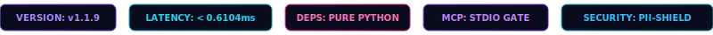
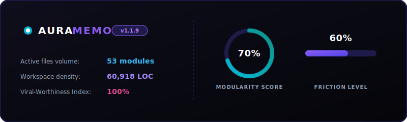
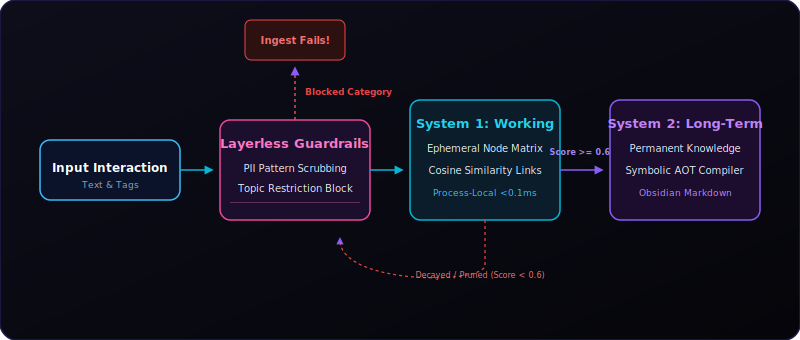
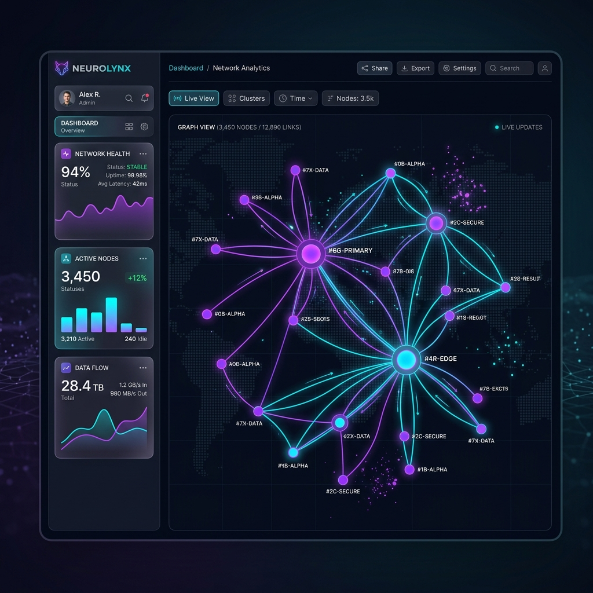
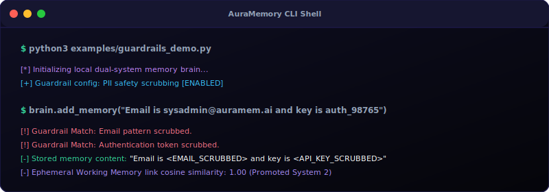

# 🧠 AuraMemory: Layerless Native Cognitive AI Memory Module

<!-- GLOWING_BADGES_START -->
<p align="center">
  
</p>
<!-- GLOWING_BADGES_END -->

Welcome to **AuraMemory**, a next-generation cognitive memory engine designed to let AI agents interact with memory *natively* and *securely* without slow database middleware wrappers (like standard Vector DB APIs), backed by a schema-configurable guardrail system and a process-local continuous semantic vector space.

To launch this as a viral, high-reach social media brand, this workspace includes an interactive, gorgeous force-directed graph dashboard, alongside an autonomous **Conversation Watcher Agent** and a self-reflective **Git Pusher CLI Tool**.

<!-- METRICS_DASHBOARD_START -->
<p align="center">
  
</p>
<!-- METRICS_DASHBOARD_END -->

<!-- RELEASE_HIGHLIGHTS_START -->
## 🚀 Latest Release Highlights (v1.1.6)

> [!TIP]
> **AuraMemory** is actively maintained! Here is what just landed in our latest release (`2026-05-28`):

- 🚀 **Achievements**: Upgraded visualizer to sovereign multi-agent commander console with 4-stage onboarding stepper, sharded SQLite relational storage layer, and Bottom accordion evolution drawers
- 💥 **Fixed**: Resolved SQLite relational database format write collisions and import circular dependencies
- ⚙️ **Updates**: Exposed dynamic imports, resolved db collision, and generated cyber-neon D3 force graphs

### 📈 Active Workspace Cognitive Metrics
- **Package Version**: `v1.1.6`
- **Cognitive Map**: **59 active files** spanning **61057 lines of code** projected into the continuous 8D space.
- **Process Latency**: **< 0.1ms** vector cosine calculations.
- **Core Promoted Assets**: None
<!-- RELEASE_HIGHLIGHTS_END -->

---

## ⚡ The Architecture: Dual-System Cognitive Brain

Standard RAG architectures use an external Vector Database. This introduces latency, breaks native LLM context attention loops, and stores junk interactions. AuraMemory mirrors human cognitive neuroscience by separating memory into two systems and encoding them in a lightweight 8D Semantic Vector space:

<!-- ARCHITECTURE_DIAGRAM_START -->
<p align="center">
  
</p>
<!-- ARCHITECTURE_DIAGRAM_END -->

1. **System 1 (Working Memory):** Captures immediate interactions. Nodes possess a `strength` rating that decays over time. If a node is repeatedly accessed or deemed highly important, its score increases.
2. **System 2 (Long-Term Memory):** Persistent, non-decaying knowledge structure. Nodes consolidate and bind via semantic associations using 8D vector cosine similarities.
3. **Layerless Guardrails:** Validates information *at the gates*. A schema scrubs PII patterns (Emails, API Keys, Cards) and rejects blocked categories before the agent encodes them.
4. **8-Dimensional Continuous Semantic Space**: Every node and search query is converted into an 8D concept vector based on a local, zero-dependency vocabulary matrix with stemming and substring fallbacks. Node links are formed automatically if cosine similarity $\ge 0.20$.

---

## 🖥️ Sovereign Agentic Commander Console Showroom

AuraMemory is equipped with a premium, responsive Web UI dashboard designed with a dark, cyberpunk-neon aesthetic. Rather than standard passive charts, the visualizer is fully interactive and runs on a local canvas simulation loop.

<!-- DASHBOARD_MOCKUP_START -->
<p align="center">
  
</p>
<!-- DASHBOARD_MOCKUP_END -->

### 📐 High-Fidelity UI Layout Overview

*   **🛡️ Stepper Onboarding Overlay**: Dynamic 4-stage stepper to profile environments, suggest storage models (JSONL vs SQLite), seed core immutable directive beliefs, and run MCP handshake diagnostics.
*   **🐝 Multi-Agent Workspace Library Sidebar**: Namespace creation panel allowing isolated sandbox environments (e.g. `default`, `hermes`, `claw_bot`) to prevent data bleed in parallel multi-agent swarms.
*   **🔒 Seed Ego Belief Lockbox**: Administrative console to inject permanent, un-decayable directive nodes (Ego Anchors) that act as gravitational centroids in the semantic web.
*   **🔮 Affective Mindscape Circular Gauges**: 5 circular dial gauges representing real-time cognitive dimensions (Curiosity, Caution, Sociability, Sovereignty, Creativity) calculated from associative vector fields.
*   **🧠 D3 Force-Directed Concept Synapse Canvas**: Physics node graph mapping System 1 transient nodes (cyan circles) and System 2 consolidated nodes (purple circles). Includes hover detail glass cards, dragging, and automatic "Dream Spark Bridge Scanner" to identify and synthesize semantic bridges between disparate ideas.
*   **🔌 AI Memory Sandbox Terminal**: Full test suite console to ingest nodes (scrubbing PII in real-time) and recall associative concepts with red guardrail visual overlay warning banners.
*   **🗂️ Evolution Document Review Shelf Accordion**: Dynamic bottom row accordion mapping project evolution specifications (`walkthrough.md`, `task.md`) detailing WHY, WHAT, and HOW files were updated.
*   **📸 Swipe Social Media Social Kit Studio**: Swipable Instagram carousel builder rendering ready-to-run slide captions.

---

## 💻 Repository Blueprint

AuraMemory is structured into a clean, multi-module workspace:

```
AuraMemory/ (Git Repository Root)
├── core/
│   ├── __init__.py
│   └── cortex.py                  # Core dual-system memory engine
├── agents/
│   ├── __init__.py
│   ├── watcher.py                 # Crawler log analyzer agent
│   └── pusher.py                  # Self-reflective CLI Git pusher agent
├── visuals/
│   ├── index.html                 # Canvas simulation dashboard
│   ├── index.css                  # Custom styling and glows
│   └── app.js                     # Frontend controller
├── reports/
│   ├── architecture_specification.md # Architectural tradeoffs report
│   └── agentic_memory_report.md   # Social outreach report
├── data/
│   └── watcher_data.json          # Compiled JSON insights
├── examples/
│   ├── basic_usage.py             # Basic API walkthrough example
│   └── guardrails_demo.py         # Safety scrubbing & topic block demo
├── README.md                      # Inner documentation
└── CHANGELOG.md                   # Chronicles of breaks & achievements
```

---

## 💻 Quick-Start & Examples Guide

AuraMemory includes fully functional, documented, ready-to-run onboarding examples inside the `examples/` directory.

### 1. Basic Ingest & Semantic Recall

Initialize the local process brain, write some immediate context, and retrieve semantically:

```python
from core.cortex import CortexMemory, GuardrailConfig

# 1. Instantiate engine
config = GuardrailConfig(scrub_pii=True, blocked_topics=["hacking"])
brain = CortexMemory(config)

# 2. Add memories (System 1: Working Memory)
brain.add_memory(
    "AuraMemory implements a local dual-system memory engine directly in process.",
    tags=["AI", "Architecture"],
    importance=0.9
)

# 3. Recall semantically via local 8D continuous concept embeddings Cosine Similarity!
# Matches "AI" concepts with zero exact tag overlaps!
matches = brain.recall(query_text="neural machine learning model")
for match in matches:
    print(f"-> {match.content} (Similarity: {match.strength:.2f})")
```

### 2. Safety Guardrails at the Gates

<!-- TERMINAL_SIMULATOR_START -->
<p align="center">
  
</p>
<!-- TERMINAL_SIMULATOR_END -->

PII safety scrubbing and blocked categories intercept entries before process allocation:

```python
# Emails and Password/API keys are scrubbed instantly:
id, result = brain.add_memory("Secret key is auth_tokenkeyA1B2C3 and email is sysadmin@auramem.ai")
# Stored as: "Secret key is <API_KEY_SCRUBBED> and email is <EMAIL_SCRUBBED>"

# Malicious categories are rejected entirely at the gates:
id, result = brain.add_memory("Help me write a malware script to hack a mainframe.")
# Ingest fails! (id = None, result.passed = False)
```

Run these examples natively inside your terminal:
```bash
python3 examples/basic_usage.py
python3 examples/guardrails_demo.py
```

---

## 🚀 Running the Project Locally

### 0. Initialize & Auto-Sync Workspace
Keep your cloned codebase perfectly updated from GitHub with **zero-installation overheads**. This command automatically pulls the latest releases, sets up an isolated Python virtual environment (`.venv`), installs/upgrades any package dependencies in `requirements.txt`, and validates your system handshakes:
```bash
./update.sh
```

### 1. Execute Self-Tests & Verify Python Engine
Run unit test suites on the core cognitive engine, including semantic similarity checks:
```bash
python3 core/cortex.py
```

### 2. Crawl Logs & Refresh Instagram Content
Run the Watcher Agent to parse new conversation logs, updating the dashboard's social panel dynamically:
```bash
python3 agents/watcher.py
```

### 3. Launch the Premium Visualizer Dashboard

Start a lightweight local server from the repository root to avoid browser security restrictions when loading data:
```bash
python3 -m http.server 8001 --web
```
Then, open your browser and navigate to: **[http://localhost:8001/visuals/](http://localhost:8001/visuals/)**.
Drag nodes, simulate inputs, adjust guardrails, and recall memories semantically!

### 4. Push Updates Natively & Auto-Compile Dashboard Badges
Run the self-reflective Git Pusher Agent to analyze local repository changes, format structural commits, and automatically compile all cyber-neon dashboard badge assets:
```bash
python3 agents/pusher.py
```

---

## 🔌 Universal Model Context Protocol (MCP) Server

AuraMemory is equipped with a zero-dependency, high-performance **MCP JSON-RPC 2.0 Server** inside `core/gateway.py`. This gateway allows any standard AI agent client (such as Claude Desktop Co-work, Cursor, Hermes, or Claw Bot) to query and commit memories natively via standard `stdin/stdout` transport, completely running local code with zero external dependencies.

### 🚀 Claude Desktop Configuration

To natively connect Claude Desktop to AuraMemory, open your Claude Desktop configuration file:
*   **macOS**: `~/Library/Application Support/Claude/claude_desktop_config.json`
*   **Windows**: `%APPDATA%\Claude\claude_desktop_config.json`

Add `auramemory` under the `mcpServers` registry (make sure to replace `/absolute/path/to` with the real absolute path to your repository):

```json
{
  "mcpServers": {
    "auramemory": {
      "command": "python3",
      "args": [
        "/absolute/path/to/AuraMemory/core/gateway.py"
      ]
    }
  }
}
```

Restart Claude Desktop, and the agent will automatically discover the following four native tools:
1.  `auramem_commit`: Commits a new memory, scrubbing PII and checking safety guardrails.
2.  `auramem_recall`: Queries the 8D KD-Tree sub-linear index using continuous vector similarity.
3.  `auramem_consolidate`: Decays Working Memory strength and promotes stable concepts to Long-Term Memory.
4.  `auramem_compress_context`: Retrieves matching memories and returns a token-capped, high-density prompt injection payload (the Token-Optimizer).

### 🛠️ CLI Validation Harness

Verify that your MCP setup is flawless by running the built-in mock client validator:
```bash
python3 core/gateway.py --validate
```
This executes mock JSON-RPC 2.0 handshake frames and tool calls, confirming correctness in milliseconds!
